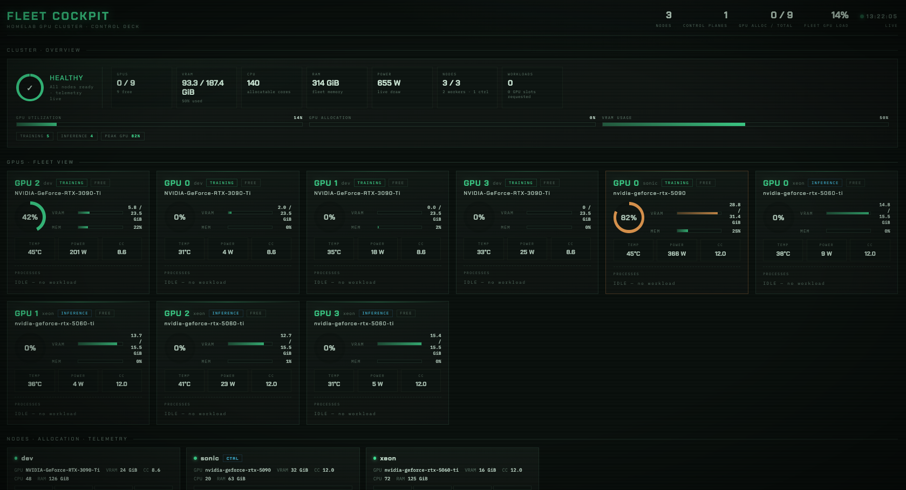

# Homelab GPU Cluster

Turn a pile of mismatched machines into one GPU cluster you can add to, remove from,
and target — without babysitting each box. Built on **k3s**, the **NVIDIA GPU Operator**,
and **DRA** for per-GPU scheduling. Wrapped in a friendly `make` interface so you rarely
touch raw `kubectl`.

> For people who *know their way around* Kubernetes but don't want to *become a
> Kubernetes administrator* to run a homelab.

<p align="center">
  
  <br>
  <em>Fleet Command: cluster health, fleet-wide usage, and one card per GPU.</em>
</p>

## What you get

| | |
|---|---|
| **Add a machine** | `make add-node` prints a one-liner; paste it on the new box. Drivers install, GPUs show up. |
| **Remove safely** | `make remove-node NODE=x` drains workloads first, then drops the node. |
| **Target hardware** | Tag GPUs by tier (`training`, `inference`, …) or VRAM/compute cap — not hostnames. |
| **Fleet Command** | Custom GPU-centric GUI: cluster overview, per-GPU telemetry, scale/cordon/drain/re-tier. |
| **`homelab` CLI** | Probes GPUs at join time (`nvidia-smi`), auto-labels VRAM, compute cap, tier. |
| **Batteries** | Longhorn storage, DCGM → Grafana, Headlamp for deep k8s, works over Tailscale. |
| **App deploys** | Register app repos, scaffold new services, deploy to k3s + mlapi.us from one contract. |

<p align="center">
  
  <br>
  <em>Node cards with allocation meters, live DCGM telemetry, and drain/cordon controls.</em>
</p>

## Quick start

On your controller machine:

```bash
git clone <this-repo> gpu-cluster && cd gpu-cluster
make config                 # creates config/cluster.env
$EDITOR config/cluster.env   # set SERVER_HOST to THIS machine's IP
make preflight
make server
make kubeconfig
make stack                  # GPU Operator + DRA + storage + monitoring + GUIs
make label-gpus
make status
make cockpit-ui             # Fleet Command → http://<node-ip>:30880
```

Add a GPU worker:

```bash
make add-node               # on controller — copy the printed join line
# on the new machine:
JOIN_TOKEN='...' make agent
make label-gpus             # back on controller
```

Send work to your big GPUs:

```bash
kubectl apply -f manifests/examples/02-training-job-nodeselector.yaml
```

## Fleet Command

The GUI you actually want for day-to-day GPU ops — not another generic k8s dashboard.

- **Cluster overview** — fleet health, total GPUs/VRAM/CPU/RAM/power, utilization bars, tier breakdown, active issues
- **Per-GPU cards** — utilization ring, VRAM, temp, power, processes/pods on each card
- **Node management** — allocation meters, live DCGM telemetry, cordon, PDB-respecting drain, re-tier
- **Workloads** — scale your Deployments with +/−

```bash
make cockpit          # install / update in the cluster
make cockpit-ui       # port-forward to localhost
make cockpit-demo     # preview locally with fake data (no cluster needed)
```

Stable URL on your LAN: **`http://<any-node-ip>:30880`**

## `homelab` CLI

Stdlib Python, no pip. Hardware-aware node management:

```bash
make cli
homelab doctor --fix
homelab discover            # GPUs, VRAM, compute cap, auto-tier
homelab join worker --token 'K10...'
homelab status              # fleet table
homelab app list            # registered apps + cluster status
homelab app deploy plateforge
```

Workloads can target capabilities, not machine names:

```yaml
nodeSelector:
  gpu.homelab/vram-gb: "24"
  gpu.homelab/tier: training
```

## Managed app deploys

Deploy application repos to the cluster with a shared contract — build, apply manifests,
import images, verify health, and sync mlapi.us nginx routing.

**Plateforge** (`~/git/electroplate`) is the reference implementation.

```bash
# Scaffold a new service
make app-init NAME=myapp REPO=~/git/myapp PORT=8080

# Fleet overview
make app-list
make app-validate-all

# Deploy (build → k3s import → apply → verify → nginx upstream sync)
make app-validate APP=plateforge
make app-deploy APP=plateforge

# Persistent session storage (Longhorn PVC)
SESSIONS_STORAGE=pvc make app-deploy APP=plateforge
```

Each app repo provides `system.yaml` + `k8s/overlays/{homelab,production}`.
System holds `apps/<name>.yaml` (repo pointer), deploy scripts, and `nginx/` configs.

```bash
homelab app list
homelab app deploy plateforge
```

Full guide: [`docs/09-app-deploys.md`](docs/09-app-deploys.md)

## Layout

```
apps/        registered app repos (apps/<name>.yaml → system.yaml contract)
cli/         homelab CLI (discover, join, status) — make cli
cockpit/     Fleet Command source (Python + vanilla JS, no build step)
config/      cluster.env — the ONE file you edit
schema/      system.yaml.example — copy to app repos
scripts/     install, join, remove, label, stack, cockpit, deploy-app
manifests/   GPU Operator, DRA DeviceClasses, cockpit, examples
nginx/       mlapi.us edge routing per app
docs/        guides, screenshots, troubleshooting
Makefile     friendly command menu — make help
```

## Docs

| Topic | Guide |
|-------|-------|
| Overview | [`docs/01-overview.md`](docs/01-overview.md) |
| Install walkthrough | [`docs/02-install-walkthrough.md`](docs/02-install-walkthrough.md) |
| GPU targeting | [`docs/03-gpu-targeting.md`](docs/03-gpu-targeting.md) |
| Managing nodes | [`docs/04-managing-nodes.md`](docs/04-managing-nodes.md) |
| GUIs & monitoring | [`docs/06-gui-and-monitoring.md`](docs/06-gui-and-monitoring.md) |
| CLI & Fleet Command | [`docs/07-cli-and-cockpit.md`](docs/07-cli-and-cockpit.md) |
| Troubleshooting | [`docs/05-troubleshooting.md`](docs/05-troubleshooting.md) |
| Container registry | [`docs/08-container-registry.md`](docs/08-container-registry.md) |
| App deploys | [`docs/09-app-deploys.md`](docs/09-app-deploys.md) |
| Glossary | [`docs/glossary.md`](docs/glossary.md) |

## Requirements

- Ubuntu/Debian machines (others untested).
- NVIDIA GPUs. Consumer cards (30xx/40xx/50xx): install the host driver first
  (`sudo apt install nvidia-driver-XXX`) and keep `GPU_OPERATOR_MANAGES_DRIVER=0`.
- Kubernetes ≥ 1.34 for DRA per-GPU targeting (k3s `stable` is fine). Node-label
  targeting works on any version.

## Legacy

Pre-k3s scripts, docker-compose stacks, and one-off deployments live in
[`manual_deployments/`](manual_deployments/README.md). Reference only — do not extend.
